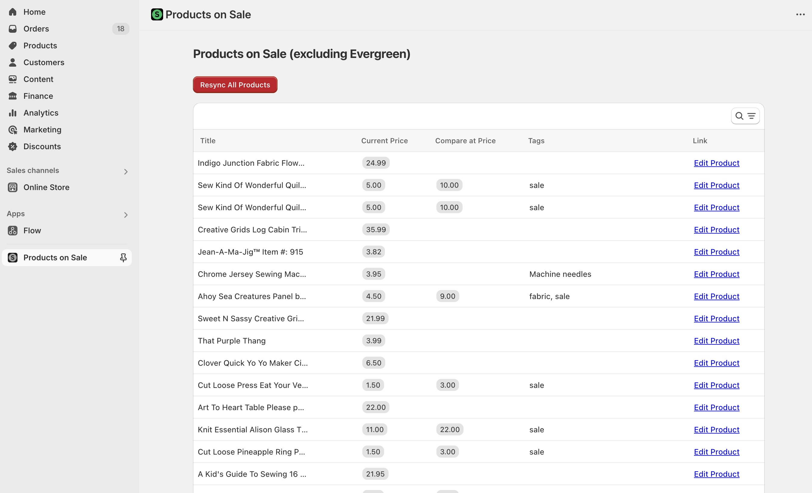

# Products on Sale Custom Shopify App

My client needed a way to easily see which of her oldest products needed to go on sale or be marked down futher.

She has some products that will never go on sale, and those have are tagged with the tag "Evergreen". The native Shopify product list view does not support displaying all products that are NOT tagged with a specific tag, so I built this custom app to give her the needed display.

It queries the Shopify GraphQL API to pull all product data into the gadget.dev database, then displays the products in a table with only the relevant colums:

* Title
* Current Price
* Compare At Price
* Tags
* Link

Every time the store owner needs to update her sale pricing, she pulls up this report, which is sorted by oldest to newest product, and clicks on the "Edit product" link to open the product she wants to edit.

The report is automatically updated as data in Shopify changes.
